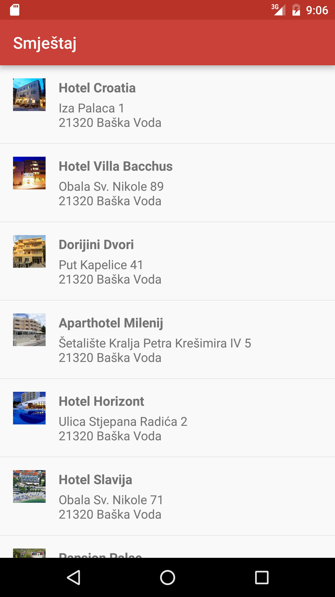
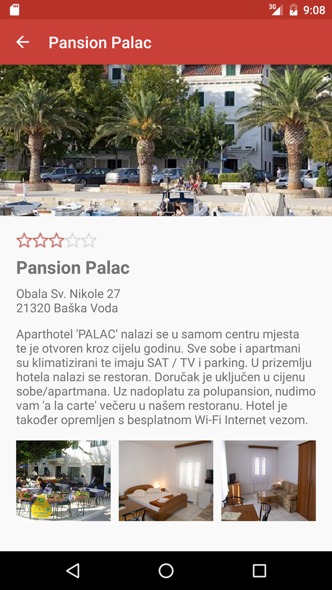

# Smještaj (Lodging)

 

_Smještaj_ (_Lodging_) is a straightforward Android application for reviewing lodging options.

The project was created with the intention of evaluating my capabilities as a fledgling Android developer. As such, the code is only really useful for educational purposes.

Consider sources to be shared under the IDGAF license. All asset images are provided courtesy of TripAdvisor.